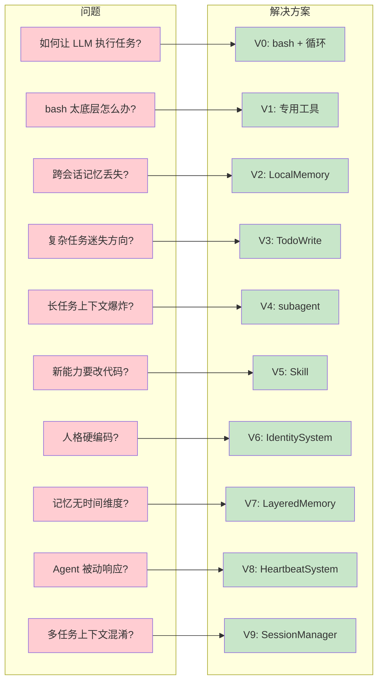
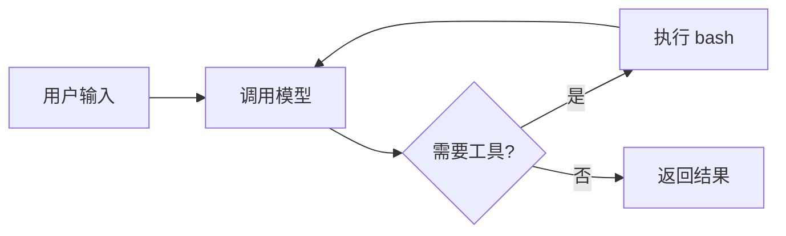
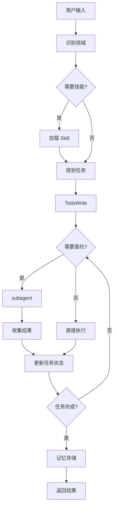
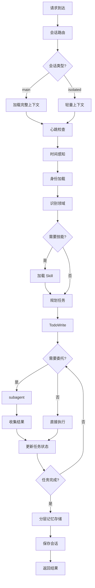

# Learn OpenClaw - Agent 进化之路

> 从 80 行代码到完整 Agent 系统的渐进式学习路径

## 🗺️ 进化全景图

```mermaid
graph TB
    subgraph V0["V0: Bash 即一切 (~150行)"]
        V0_TOOL[bash]
        V0_LOOP[Agent 循环]
        V0_TOOL --> V0_LOOP
    end

    subgraph V1["V1: 模型即代理 (~360行)"]
        V1_TOOLS[bash + read + write + edit + grep]
        V1_SAFE[safePath 安全边界]
        V1_TOOLS --> V1_SAFE
    end

    subgraph V2["V2: 记忆即上下文 (~450行)"]
        V2_MEM[LocalMemory]
        V2_JACCARD[Jaccard 相似度]
        V2_INDEX[.index.json]
        V2_MEM --> V2_JACCARD
        V2_MEM --> V2_INDEX
    end

    subgraph V3["V3: 规划即执行 (~480行)"]
        V3_TODO[TodoManager]
        V3_WRITE[TodoWrite]
        V3_STATUS[pending/in_progress/completed]
        V3_TODO --> V3_WRITE
        V3_TODO --> V3_STATUS
    end

    subgraph V4["V4: 委托即协作 (~570��)"]
        V4_SUB[subagent]
        V4_PROC[进程递归]
        V4_ISO[上下文隔离]
        V4_SUB --> V4_PROC
        V4_SUB --> V4_ISO
    end

    subgraph V5["V5: 技能即扩展 (~720行)"]
        V5_SKILL[SkillLoader]
        V5_YAML[YAML Frontmatter]
        V5_MD[Markdown 技能文件]
        V5_SKILL --> V5_YAML
        V5_SKILL --> V5_MD
    end

    subgraph V6["V6: 身份即人格 (~930行)"]
        V6_ID[IdentitySystem]
        V6_SOUL[SOUL.md]
        V6_USER[USER.md]
        V6_ID --> V6_SOUL
        V6_ID --> V6_USER
    end

    subgraph V7["V7: 时间即维度 (~1176行)"]
        V7_MEM[LayeredMemory]
        V7_DAILY[daily_* 日记]
        V7_LONG[longterm_* 长期]
        V7_MEM --> V7_DAILY
        V7_MEM --> V7_LONG
    end

    subgraph V8["V8: 主动即价值 (~1369行)"]
        V8_HB[HeartbeatSystem]
        V8_CHECK[HEARTBEAT.md]
        V8_STATE[heartbeat-state.json]
        V8_HB --> V8_CHECK
        V8_HB --> V8_STATE
    end

    subgraph V9["V9: 隔离即安全 (~1516行)"]
        V9_SM[SessionManager]
        V9_MAIN[main 会话]
        V9_ISO[isolated 会话]
        V9_SM --> V9_MAIN
        V9_SM --> V9_ISO
    end

    V0 -->|"+专用工具"| V1
    V1 -->|"+长期记忆"| V2
    V2 -->|"+任务规划"| V3
    V3 -->|"+子代理"| V4
    V4 -->|"+技能系统"| V5
    V5 -->|"+身份系统"| V6
    V6 -->|"+分层记忆"| V7
    V7 -->|"+心跳系统"| V8
    V8 -->|"+会话管理"| V9

    style V0 fill:#e8f5e9
    style V1 fill:#e3f2fd
    style V2 fill:#fff3e0
    style V3 fill:#fce4ec
    style V4 fill:#f3e5f5
    style V5 fill:#e0f7fa
    style V6 fill:#fff9c4
    style V7 fill:#ffccbc
    style V8 fill:#d1c4e9
    style V9 fill:#b2dfdb
```



## 📊 版本对比表

| 版本 | 代码行数 | 工具数 | 核心能力 | 新增概念 |
|------|----------|--------|----------|----------|
| V0 | ~150 | 1 | 执行命令 | Agent 循环 |
| V1 | ~360 | 5 | 文件操作 | 专用工具、安全边界 |
| V2 | ~450 | 10 | 知识检索 | 本地向量、Jaccard |
| V3 | ~480 | 11 | 任务跟踪 | TodoWrite、状态机 |
| V4 | ~570 | 12 | 并行执行 | 进程递归、上下文隔离 |
| V5 | ~720 | 13 | 领域扩展 | Skill 系统、YAML |
| V6 | ~930 | 17 | 人格定制 | 身份系统、SOUL/USER |
| V7 | ~1176 | 24 | 时间感知 | 分层记忆、日记系统 |
| V8 | ~1369 | 30 | 主动检查 | 心跳系统、深夜静默 |
| V9 | ~1516 | 30+ | 多会话 | SessionManager、会话隔离 |

## 🎯 每个版本解决的问题



## 🔄 Agent 循环演进

### V0: 最简循环



### V5: 完整循环



### V9: 完整循环（含会话路由）



## 📁 项目结构

```
learn-openclaw/
├── v0-agent.ts              # V0: Bash 即一切
├── v1-agent.ts              # V1: 5个基础工具
├── v2-agent.ts              # V2: 本地向量记忆
├── v3-agent.ts              # V3: TodoWrite 任务规划
├── v4-agent.ts              # V4: Subagent 子代理
├── v5-agent.ts              # V5: Skill 系统
├── v6-agent.ts              # V6: 身份系统
├── v7-agent.ts              # V7: 分层记忆
├── v8-agent.ts              # V8: 心跳系统
├── v9-agent.ts              # V9: 会话管理
├── docs/
│   ├── v0-Bash即一切.md      # V0 教学文档
│   ├── v1-模型即代理.md      # V1 教学文档
│   ├── v2-向量记忆系统.md    # V2 教学文档
│   ├── v3-任务规划系统.md    # V3 教学文档
│   ├── v4-子代理协调.md      # V4 教学文档
│   ├── v5-Skill系统.md       # V5 教学文档
│   ├── v6-身份系统.md        # V6 教学文档
│   ├── v7-分层记忆.md        # V7 教学文档
│   ├── v8-心跳系统.md        # V8 教学文档
│   ├── v9-会话管理.md        # V9 教学文档
│   └── evolution/
│       ├── v0-to-v1.md      # V0→V1 演进文档
│       ├── v1-to-v2.md      # V1→V2 演进文档
│       ├── v2-to-v3.md      # V2→V3 演进文档
│       ├── v3-to-v4.md      # V3→V4 演进文档
│       ├── v4-to-v5.md      # V4→V5 演进文档
│       ├── v5-to-v6.md      # V5→V6 演进文档
│       ├── v6-to-v7.md      # V6→V7 演进文档
│       ├── v7-to-v8.md      # V7→V8 演进文档
│       └── v8-to-v9.md      # V8→V9 演进文档
├── skills/                   # V5 技能目录
│   └── hello/SKILL.md
├── memory/                   # V2/V7 记忆目录
│   ├── .index.json          # V2 索引
│   └── YYYY-MM-DD.md        # V7 日记
├── .sessions/               # V9 会话目录
│   └── session_*.json
├── AGENTS.md                # V6 行为规范
├── SOUL.md                  # V6 核心价值观
├── IDENTITY.md              # V6 当前身份
├── USER.md                  # V6 用户偏好
├── MEMORY.md                # V7 长期记忆
├── HEARTBEAT.md             # V8 心跳清单
└── .env                      # 环境配置
```

## 🚀 快速开始

```bash
# 1. 克隆项目
git clone https://github.com/xxx/learn-openclaw.git
cd learn-openclaw

# 2. 安装依赖
npm install

# 3. 配置环境
cp .env.example .env
# 编辑 .env 设置 ANTHROPIC_API_KEY

# 4. 运行任意版本
npx tsx v0-agent.ts "你好"
npx tsx v5-agent.ts "加载 hello 技能"
```

## 📚 学习路径

### 推荐顺序

#### 第一阶段：技术能力 (V0-V5)

1. **V0** - 理解 Agent 本质
   - 阅读 v0-agent.ts (~150行)
   - 阅读 [v0-Bash即一切.md](v0-Bash即一切.md)
   - 理解 Agent 循环

2. **V1** - 理解工具系统
   - 对比 V0 和 V1 的差异
   - 阅读 [v0-to-v1.md](evolution/v0-to-v1.md) 和 [v1-模型即代理.md](v1-模型即代理.md)
   - 尝试添加新工具

3. **V2** - 理解记忆系统
   - 学习 Jaccard 相似度
   - 阅读 [v1-to-v2.md](evolution/v1-to-v2.md) 和 [v2-向量记忆系统.md](v2-向量记忆系统.md)
   - 摄入文档并搜索

4. **V3** - 理解任务规划
   - 学习状态机设计
   - 阅读 [v2-to-v3.md](evolution/v2-to-v3.md) 和 [v3-任务规划系统.md](v3-任务规划系统.md)
   - 创建复杂任务计划

5. **V4** - 理解分布式协作
   - 学习进程递归
   - 阅读 [v3-to-v4.md](evolution/v3-to-v4.md) 和 [v4-子代理协调.md](v4-子代理协调.md)
   - 委托子任务

6. **V5** - 理解技能系统
   - 学习 YAML frontmatter
   - 阅读 [v4-to-v5.md](evolution/v4-to-v5.md) 和 [v5-Skill系统.md](v5-Skill系统.md)
   - 创建自定义技能

#### 第二阶段：人格能力 (V6-V8)

7. **V6** - 理解身份系统
   - 学习人格文件设计
   - 阅读 [v5-to-v6.md](evolution/v5-to-v6.md) 和 [v6-身份系统.md](v6-身份系统.md)
   - 配置 SOUL.md 和 USER.md

8. **V7** - 理解分层记忆
   - 学习时间感知设计
   - 阅读 [v6-to-v7.md](evolution/v6-to-v7.md) 和 [v7-分层记忆.md](v7-分层记忆.md)
   - 使用日记和长期记忆

9. **V8** - 理解心跳系统
   - 学习主动性设计
   - 阅读 [v7-to-v8.md](evolution/v7-to-v8.md) 和 [v8-心跳系统.md](v8-心跳系统.md)
   - 配置 HEARTBEAT.md

#### 第三阶段：会话管理 (V9)

10. **V9** - 理解会话管理
    - 学习多会话隔离
    - 阅读 [v8-to-v9.md](evolution/v8-to-v9.md) 和 [v9-会话管理.md](v9-会话管理.md)
    - 创建 main 和 isolated 会话

## 💡 核心洞察

> **模型占 80%，代码占 20%**
>
> 现代 Agent 之所以工作，是因为模型被训练成 Agent。
> 代码只是提供工具和循环，真正的智能来自模型。

> **奥卡姆剃刀原则**
>
> 每个版本只增加必要的复杂度。
> V0 证明了一个工具足够，V9 证明了复杂系统可以渐进构建。

> **渐进式复杂度**
>
> 不要一开始就构建复杂系统。
> 从最简单的版本开始，按需演进。

> **三阶段演进**
>
> - V0-V5: 技术能力（工具、记忆、规划、协作、扩展）
> - V6-V8: 人格能力（身份、时间感知、主动性）
> - V9: 会话管理（多会话、隔离、路由）

## 🔗 相关资源

- [OpenClaw 源码](https://github.com/openclaw/openclaw)
- [Claude Code](https://claude.ai/code)
- [Anthropic API 文档](https://docs.anthropic.com)
- [learn-claude-code](https://github.com/shareAI-lab/learn-claude-code)

---

**Happy Learning! 🎓**
