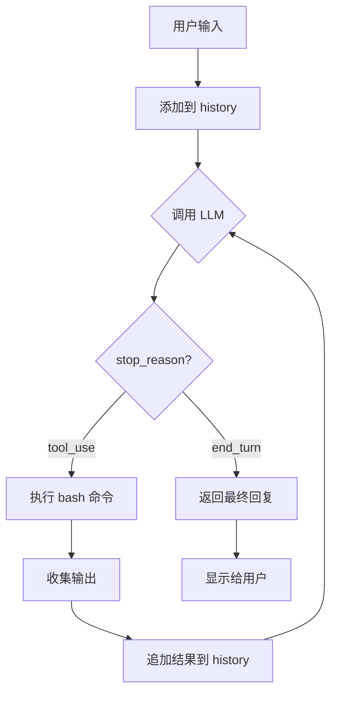
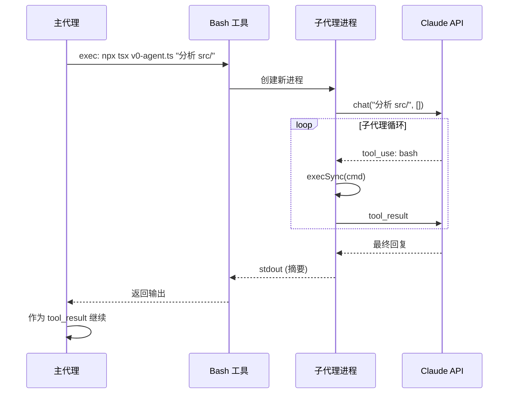

# V0: Bash 即一切

**终极简化：约150行、1个工具、完整的 Agent 功能。**

V1、V2、V3 构建完成后，一个问题浮现：Agent 的*本质*是什么？

V0 通过逆向回答这个问题——不断削减直到只剩核心。

---

## 核心洞察

Unix 哲学：一切皆文件，一切皆可管道。Bash 是通往这个世界的入口：

| 你需要做的事 | Bash 命令 |
|-------------|-----------|
| 读取文件 | `cat`, `head`, `grep` |
| 写入文件 | `echo '...' > file` |
| 搜索 | `find`, `grep`, `rg` |
| 执行 | `python`, `npm`, `make` |
| **子代理** | `npx tsx v0-agent.ts "task"` |

最后一行是关键洞察：**通过 bash 调用自身来实现子代理**。不需要 Task 工具，不需要 Agent Registry——只是简单的递归。

---

## 完整代码

```typescript
#!/usr/bin/env tsx
import Anthropic from "@anthropic-ai/sdk";
import { execSync } from "child_process";
import * as readline from "readline";
import { config } from "dotenv";

// 加载 .env 文件
config();

// 检查 API Key
if (!process.env.ANTHROPIC_API_KEY) {
  console.error("\x1b[31m错误: 未设置 ANTHROPIC_API_KEY 环境变量\x1b[0m");
  console.error("\n请通过以下方式之一设置:");
  console.error("  1. 创建 .env 文件: echo 'ANTHROPIC_API_KEY=your-key' > .env");
  console.error("  2. 直接导出: export ANTHROPIC_API_KEY=your-key");
  process.exit(1);
}

const client = new Anthropic({
  apiKey: process.env.ANTHROPIC_API_KEY,
  baseURL: process.env.ANTHROPIC_BASE_URL
});
const MODEL = process.env.MODEL_ID || "claude-opus-4-6";

// 唯一的工具 - 通过 bash 完成所有操作
const TOOLS: Anthropic.Tool[] = [{
  name: "bash",
  description: `执行 shell 命令。常用模式:
- 读取: cat/grep/find/ls/head/tail
- 写入: echo 'content' > file
- 子代理: npx tsx v0-agent.ts "任务描述" (生成隔离子代理)`,
  input_schema: {
    type: "object" as const,
    properties: { command: { type: "string" as const } },
    required: ["command"]
  }
}];

// 系统提示 - 教导模型如何有效使用 bash
const SYSTEM = `你是 OpenClaw V0 - 极简 Agent。使用 bash 命令解决问题。

规则:
- 工具优先于解释。先行动，后简要说明。
- 子代理: 复杂子任务生成子代理以保持上下文清洁:
  npx tsx v0-agent.ts "分析 src/ 目录架构"

子代理在隔离进程中运行，仅返回最终摘要。`;

// 核心 Agent 循环
async function chat(prompt: string, history: Anthropic.MessageParam[] = []): Promise<string> {
  history.push({ role: "user", content: prompt });

  while (true) {
    // 1. 调用模型 (system 作为消息数组的一部分，兼容代理服务器)
    const response = await client.messages.create({
      model: MODEL,
      messages: [{ role: "system", content: SYSTEM }, ...history],
      tools: TOOLS,
      max_tokens: 8000
    } as any);

    // 2. 构建助手消息内容
    const content: Anthropic.ContentBlockParam[] = response.content.map(block => {
      if (block.type === "text") {
        return { type: "text" as const, text: block.text };
      } else if (block.type === "tool_use") {
        return {
          type: "tool_use" as const,
          id: block.id,
          name: block.name,
          input: block.input as Record<string, unknown>
        };
      }
      return { type: "text" as const, text: "" };
    });
    history.push({ role: "assistant", content });

    // 3. 如果没有工具调用，直接返回结果
    if (response.stop_reason !== "tool_use") {
      return response.content
        .filter((b): b is Anthropic.TextBlock => b.type === "text")
        .map(b => b.text).join("");
    }

    // 4. 执行每个工具调用并收集结果
    const results: Anthropic.ToolResultBlockParam[] = [];
    for (const block of response.content) {
      if (block.type === "tool_use") {
        const cmd = (block.input as { command: string }).command;
        console.log(`\x1b[33m$ ${cmd}\x1b[0m`); // 黄色显示命令

        try {
          const output = execSync(cmd, { encoding: "utf-8", timeout: 300000 });
          console.log(output || "(empty)");
          results.push({ type: "tool_result", tool_use_id: block.id, content: output.slice(0, 50000) });
        } catch (e: any) {
          const err = e.stderr || e.message || String(e);
          console.log(`\x1b[31m${err}\x1b[0m`); // 红色显示错误
          results.push({ type: "tool_result", tool_use_id: block.id, content: err, is_error: true });
        }
      }
    }

    // 5. 追加结果并继续循环
    history.push({ role: "user", content: results });
  }
}

// 主入口: argv[2] ? 子代理模式 : REPL 交互模式
if (process.argv[2]) {
  chat(process.argv[2]).then(console.log).catch(console.error);
} else {
  const rl = readline.createInterface({ input: process.stdin, output: process.stdout });
  const history: Anthropic.MessageParam[] = [];
  const ask = () => rl.question("\x1b[36m>> \x1b[0m", async (q) => {
    if (q === "q" || q === "" ) return rl.close();
    console.log(await chat(q, history)); ask();
  });
  console.log("OpenClaw V0 - 输入 'q' 或空行退出"); ask();
}
```

这就是完整的 Agent。约150行（含环境变量检查和错误处理）。

---

## 子代理的工作原理

```
主代理
  └─ bash: npx tsx v0-agent.ts "分析架构"
       └─ 子代理（隔离进程，全新历史）
            ├─ bash: find . -name "*.ts"
            ├─ bash: cat src/main.ts
            └─ 通过 stdout 返回摘要
```

**进程隔离 = 上下文隔离**
- 子进程拥有独立的 `history=[]`
- 父进程将 stdout 捕获为工具结果
- 递归调用支持无限层级嵌套

---

## V0 与 OpenClaw 的映射

| V0 概念 | OpenClaw 真实文件 | 说明 |
|---------|-------------------|------|
| `chat()` 循环 | `src/agents/pi-embedded-runner/run/attempt.ts` | `activeSession.prompt()` 实现 |
| `TOOLS` 定义 | `src/agents/pi-tools.ts` | `createOpenClawCodingTools()` |
| `execSync(cmd)` | `src/agents/tools/bash-tools.ts` | Bash 工具执行 |
| 子代理递归 | `src/agents/subagent-registry.ts` + `sessions-spawn-tool.ts` | 子代理生命周期管理 |
| `history[]` | `src/sessions/` | Session 状态管理 |
| `SYSTEM` prompt | `src/agents/agent-scope.ts` | Agent identity 配置 |

---

## V0 牺牲了什么

| 功能 | V0 | 完整 OpenClaw |
|------|-----|---------------|
| 工具数量 | 1个 (bash) | 40+ 个 |
| 子代理类型 | 无类型区分 | explore/code/plan 等 |
| 工具过滤 | 无 | 白名单机制 |
| 进度显示 | 普通 stdout | 内联更新 |
| Session 管理 | 内存中的数组 | 持久化存储 |
| Lane 并发 | 无限制 | Main/Subagent/Cron/Nested |
| Channel 抽象 | 无 | 多平台统一接入 |
| Claws 系统 | 无 | 50+ 内置技能 |
| 代码复杂度 | ~150行 | ~数万行 |

---

## V0 证明了什么

**复杂能力源于简单规则：**

1. **一个工具足够** — Bash 是通往一切的入口
2. **递归 = 层级** — 自我调用实现子代理
3. **进程 = 隔离** — OS 提供上下文隔离
4. **提示 = 约束** — 指令塑造行为

核心模式永不改变：

```typescript
while (true) {
  const response = await model(messages, tools);
  if (response.stop_reason !== "tool_use") return response.text;
  const results = execute(response.tool_calls);
  messages.push(results);
}
```

其他一切——Todo、子代理、权限——都是这个循环周围的增强。

---

## Agent Loop 流程图



---

## 子代理序列图



---

## 使用方法

### 1. 安装依赖

```bash
cd /Users/swmt/work/deepwork/learn-openclaw
npm install
```

### 2. 配置 API Key

**方式一: 使用 .env 文件 (推荐)**

```bash
# 复制示例文件
cp .env.example .env

# 编辑 .env 填入你的 API Key
echo 'ANTHROPIC_API_KEY=your-api-key-here' > .env
```

**方式二: 直接导出环境变量**

```bash
export ANTHROPIC_API_KEY="your-api-key"
# 可选: export MODEL_ID="claude-opus-4-6"
```

获取 API Key: https://console.anthropic.com/settings/keys

### 3. 运行

```bash
# 交互模式
npx tsx v0-agent.ts

# 子代理模式（直接执行单个任务）
npx tsx v0-agent.ts "列出当前目录的文件"
```

---

**Bash 即一切。**

[← 返回 README](../README.md) | [V1: 工具系统 →](./v1-模型即代理.md)
