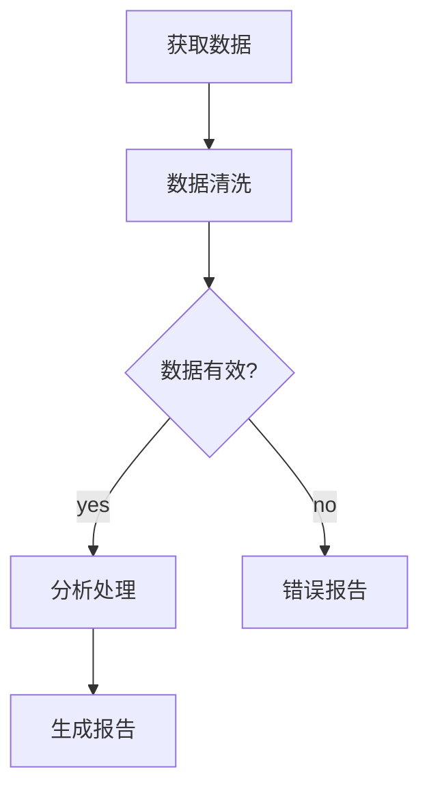

# V16: 工作流引擎

> 复杂任务的自动化编排

## 概述

V16 引入 DAG (有向无环图) 工作流引擎，支持从 Mermaid flowchart 定义复杂任务流程，自动识别并行执行机会，处理条件分支和错误恢复。

## 核心能力

### 1. Mermaid → DAG 解析

从人类可读的 Mermaid flowchart 语法创建工作流：



支持的语法：
- `A[Task]` - 普通任务节点
- `A{Condition}` - 条件判断节点
- `A((Start))` - 开始节点
- `A[[End]]` - 结束节点
- `A --> B` - 顺序依赖
- `A -->|yes| B` - 条件分支

### 2. 并行执行识别

ExecutionPlanner 自动分析依赖关系，将任务分组为可并行执行的阶段：

```
阶段 1: [A]           # 无依赖，先执行
阶段 2: [B, C]        # 都只依赖 A，可并行
阶段 3: [D]           # 依赖 B 和 C
```

### 3. 条件分支

支持 `yes/no` 条件边，根据条件节点结果决定执行路径：

```typescript
// 条件节点返回 true/false
if (node.type === 'condition') {
  const result = await executor(node, context);
  // result.value 决定走 yes 还是 no 分支
}
```

### 4. 错误恢复

- **重试机制**: 失败节点自动重试 (默认 3 次)
- **跳过策略**: 依赖失败的节点自动跳过
- **部分完成**: 返回已完成节点的结果

## 工具列表

| 工具 | 描述 |
|------|------|
| `workflow_create` | 从 Mermaid 创建工作流 |
| `workflow_plan` | 获取执行计划 |
| `workflow_run` | 执行工作流 |
| `workflow_status` | 查看工作流状态 |
| `workflow_list` | 列出所有工作流 |
| `workflow_visualize` | 可视化工作流 |

## 使用示例

### 创建工作流

```typescript
const mermaid = `
flowchart TD
    fetch[获取数据] --> clean[清洗数据]
    clean --> analyze[分析数据]
    analyze --> report[生成报告]
`;

const result = await tools.workflow_create({
  name: "数据处理流程",
  mermaid
});
// 输出: 已创建工作流: 数据处理流程
//       ID: wf_abc123
//       节点数: 4
//       执行阶段: 4
```

### 查看执行计划

```typescript
const plan = await tools.workflow_plan({ workflowId: "wf_abc123" });
// 输出: 执行计划 (4 节点, 4 阶段)
//       预估并行度: 1.0
//       阶段 1: fetch
//       阶段 2: clean
//       阶段 3: analyze
//       阶段 4: report
```

### 执行工作流

```typescript
const result = await tools.workflow_run({
  workflowId: "wf_abc123",
  context: { dataSource: "api.example.com" }
});
// 输出: 执行结果: completed
//       完成: 4 节点
//       失败: 0 节点
//       耗时: 1234ms
```

## 架构

```
v16-agent/
├── workflow/
│   ├── dag.ts          # DAG 核心实现
│   │   ├── MermaidParser      # Mermaid 解析器
│   │   ├── ExecutionPlanner   # 执行计划生成
│   │   └── WorkflowManager    # 工作流管理器
│   └── index.ts        # 工具定义和处理器
└── index.ts            # 主入口
```

## 设计亮点

1. **声明式定义**: 用 Mermaid 描述流程，无需编程
2. **自动并行**: 智能识别可并行任务，提高效率
3. **可视化**: 支持 ASCII 图形化展示工作流
4. **渐进式**: 继承 V11-V15 所有能力

## 与 OpenClaw 的对比

| 特性 | learn-openclaw V16 | OpenClaw |
|------|-------------------|----------|
| 工作流定义 | Mermaid DSL | 内置 DAG |
| 并行执行 | 自动识别 | 手动配置 |
| 条件分支 | yes/no 边 | 条件节点 |
| 错误恢复 | 重试 + 跳过 | 重试 + 回滚 |

## 下一步

V17 计划：外部集成
- MCP 协议支持
- Webhook 触发器
- API 网关

---

*实现日期: 2026-02-10*
