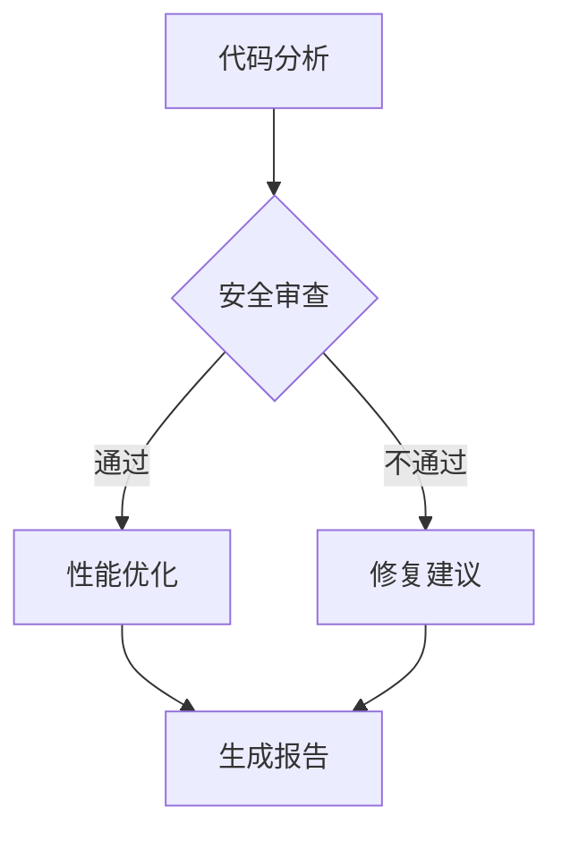

# V18: 团队协作系统

> 多 Agent 协作与任务分配

## 概述

V18 引入团队协作系统，允许 Agent 创建子代理、注册能力、智能分配任务。这是从"单体 Agent"到"Agent 团队"的转变。

## 核心能力

### 1. Sub-agent 管理

创建独立的子代理来并行处理任务:

```typescript
// 创建子代理
await tools.subagent_create({
  name: 'CodeReviewer',
  task: 'Review this code for bugs...',
  model: 'claude-3-5-haiku',
  timeout: 60000
});

// 等待结果
await tools.subagent_wait({ id: 'sub_xxx' });
```

特性:
- 进程隔离: 每个子代理独立进程
- 超时控制: 自动终止超时任务
- 输出限制: 防止输出过大
- 日志记录: 完整的执行日志

### 2. Agent 注册表

注册和发现可用的 Agent:

```typescript
// 注册 Agent
await tools.agent_register({
  name: 'CodeExpert',
  description: '擅长代码审查',
  capabilities: [
    { name: 'code_review', description: '代码审查', priority: 10 },
    { name: 'refactor', description: '代码重构', priority: 8 }
  ]
});

// 查找 Agent
await tools.agent_find({ capability: 'code_review' });
```

### 3. 任务分配

智能分配任务给合适的代理:

```typescript
// 提交任务
const task = await tools.task_submit({
  description: '优化这段代码的性能',
  requirements: ['code_review', 'optimization'],
  priority: 'high'
});

// 查看状态
await tools.task_status({ taskId: task.taskId });
```

分配策略:
- `capability-match`: 按能力匹配（默认）
- `round-robin`: 轮询
- `least-busy`: 最空闲
- `broadcast`: 广播给所有代理

## 工具列表

### Sub-agent 工具

| 工具 | 描述 |
|------|------|
| `subagent_create` | 创建子代理 |
| `subagent_list` | 列出所有子代理 |
| `subagent_status` | 查看子代理状态 |
| `subagent_wait` | 等待子代理完成 |
| `subagent_stop` | 停止子代理 |

### Agent 注册工具

| 工具 | 描述 |
|------|------|
| `agent_register` | 注册新 Agent |
| `agent_list` | 列出所有 Agent |
| `agent_find` | 按能力查找 Agent |

### 任务工具

| 工具 | 描述 |
|------|------|
| `task_submit` | 提交任务 |
| `task_status` | 查看任务状态 |
| `collaboration_report` | 生成协作报告 |

## 架构

```
v18-agent/
├── collaboration/
│   ├── subagent.ts      # Sub-agent 管理
│   ├── registry.ts      # Agent 注册表
│   ├── distributor.ts   # 任务分配器
│   └── tools.ts         # 工具定义
└── index.ts             # 主入口
```

## 使用示例

### 并行处理多个任务

```typescript
// 同时创建多个子代理
const tasks = [
  '分析代码架构',
  '检查安全漏洞',
  '优化性能瓶颈'
];

const subAgents = await Promise.all(
  tasks.map(task => tools.subagent_create({ task }))
);

// 等待所有完成
const results = await Promise.all(
  subAgents.map(agent => tools.subagent_wait({ id: agent.id }))
);
```

### 工作流集成

V18 工作流节点可以使用子代理执行:



每个节点都会创建一个 Sub-agent 来执行具体任务。

### 动态任务分配

```typescript
// 根据任务类型选择代理
const task = await tools.task_submit({
  description: '写一篇技术博客',
  requirements: ['writing', 'technical'],
});

// 系统会自动分配给具有相关能力的代理
```

## 与 OpenClaw 的对比

| 特性 | learn-openclaw V18 | OpenClaw |
|------|-------------------|----------|
| Sub-agent | 进程级隔离 | sessions_spawn |
| Agent 发现 | 本地注册表 | agents_list |
| 任务分配 | 简化版 | 完整调度系统 |
| 通信 | 文件/日志 | 消息队列 |

## 性能考虑

- 子代理是独立进程，有启动开销 (~1-2s)
- 适合长时间运行的任务 (>10s)
- 不适合高频短任务
- 同时运行子代理数建议 <10

## 安全考虑

1. **资源限制**: 超时、内存、输出大小限制
2. **隔离**: 子代理在独立进程运行
3. **审计**: 记录所有子代理操作
4. **清理**: 自动清理完成的子代理

## 下一步

V19 计划：持久化与恢复
- 子代理状态持久化
- 任务断点续传
- Agent 状态快照

---

*设计文档 - 2026-02-12*
