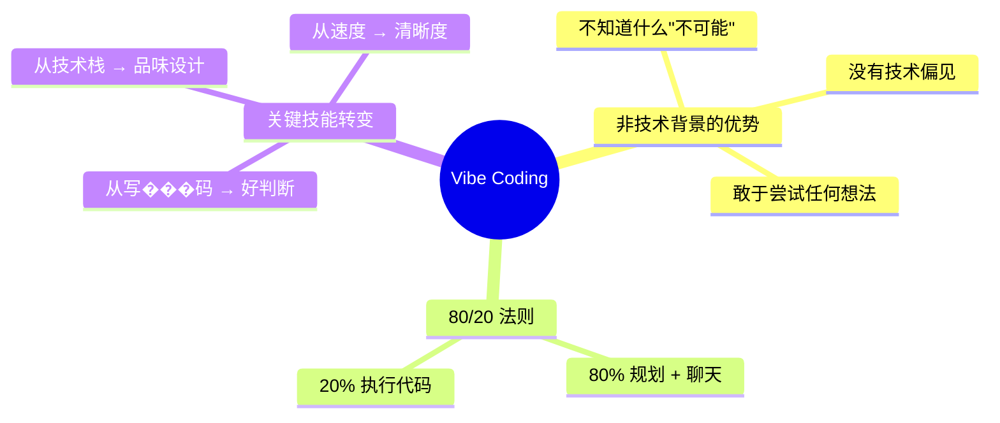
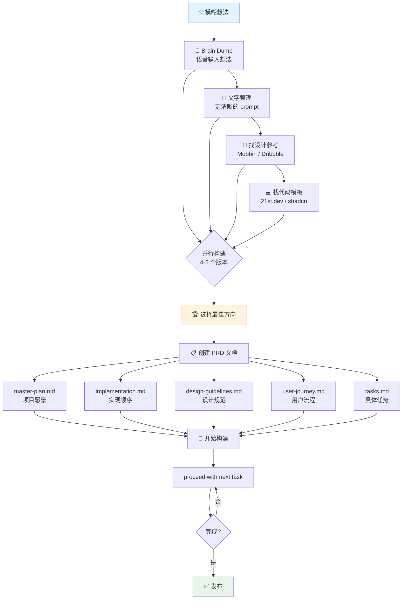
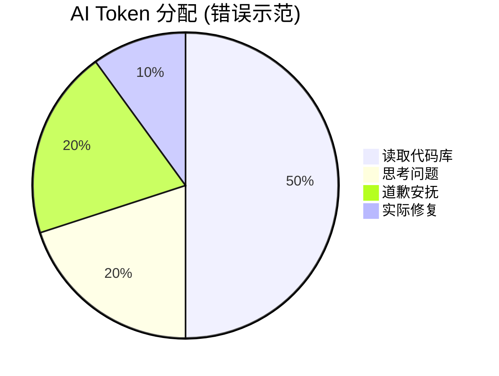
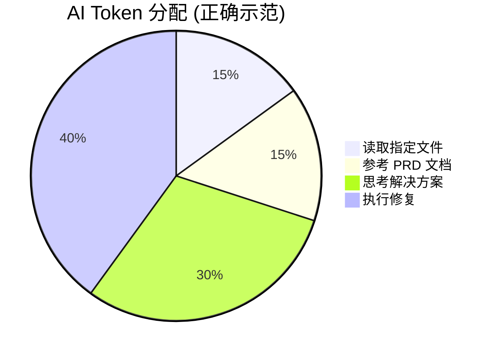
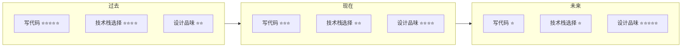
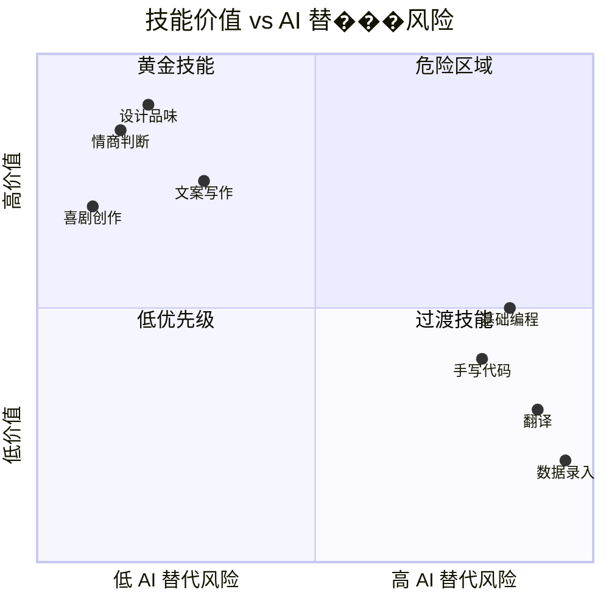
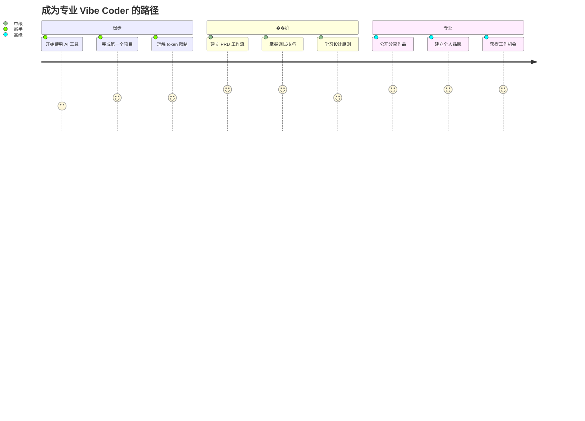
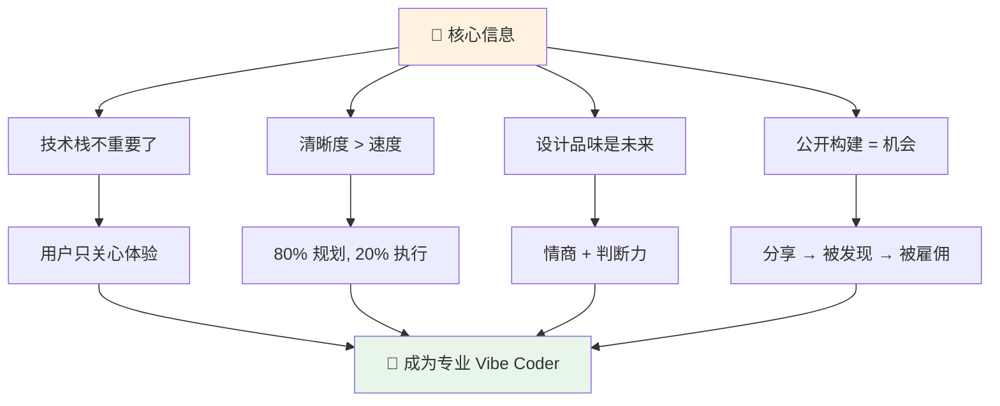

# 🎙️ The Rise of the Professional Vibe Coder

> **播客**: Lenny's Podcast  
> **嘉宾**: Lazar Yovanovich (Lovable 首位 Vibe Coding Engineer)  
> **时长**: 102 分钟  
> **核心主题**: AI 时代的新职业——专业 Vibe Coder

---

## 🧠 核心理念

---

## 🔄 Lazar 的工作流程

---

## 🔧 调试四步法 (4x4 Framework)

```mermaid
flowchart LR
    subgraph Step1[第一步: 让工具自修]
        A1[点击 Try to Fix]
        A2[让 AI 自己发现问题]
    end
    
    subgraph Step2[第二步: 增加可见性]
        B1[添加 console.log]
        B2[复制日志给 AI]
    end
    
    subgraph Step3[第三步: 外部诊断]
        C1[导出到 GitHub]
        C2[用 Codex 分析]
    end
    
    subgraph Step4[第四步: 回滚重试]
        D1[版本回退 3 步]
        D2[重新思考 prompt]
    end
    
    Step1 -->|失败| Step2
    Step2 -->|失败| Step3
    Step3 -->|失败| Step4
    
    Step4 --> E[🎓 学习环节]
    E --> F[问 AI: 如何更好地 prompt?]
    F --> G[更新 rules.md]
```

---

## 🎯 Token 分配的 Aladdin 比喻

**关键洞察**: 
- 🧞 AI 像神灯精灵，只有有限的"愿望"（tokens）
- 🎯 模糊的请求 = 浪费 tokens 在猜测上
- 📍 精确指向问题文件 = 更多 tokens 用于解决

---

## 📊 技能价值变化趋势

---

## 🎨 未来最有价值的技能

---

## 💼 如何成为专业 Vibe Coder

---

## 🔑 金句摘录

> **"AI 是放大器。如果你不知道自己在做什么，你只会更快地生产垃圾。"**

> **"写代码将变成书法——'哇，你手写的代码？太神奇了！'——它会变得如此稀有，以至于成为一种艺术。"**

> **"Good enough 曾经足够好，因为生产 good enough 本身就很难。现在每个人都能用 AI 生产 good enough，所以你必须学会生产 magic。"**

> **"AI 永远写不出好笑话。永远不会。喜剧演员不会被取代，但翻译会。"**

> **"如果你什么都不做，那就该害怕。如果你在行动，恐惧就会变成兴奋。"**

---

## 📚 推荐资源

| 类型 | 资源 | 用途 |
|------|------|------|
| 🎨 设计灵感 | Mobbin, Dribbble | 找 UI 参考 |
| 💻 代码模板 | 21st.dev, shadcn | 获取代码片段 |
| 🤖 GPT 工具 | Lovable PRD Generator | 生成项目文档 |
| 🔧 调试工具 | OpenAI Codex | 复杂问题诊断 |
| 📦 代码压缩 | RepoMix | 整合代码库 |

---

## 🎬 总结

---

*转录来源: 通义听悟 | 整理: 张一鸣 🥒*
