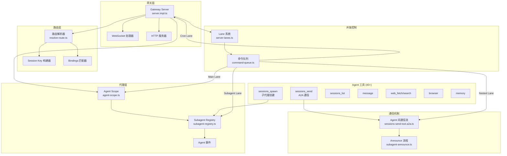
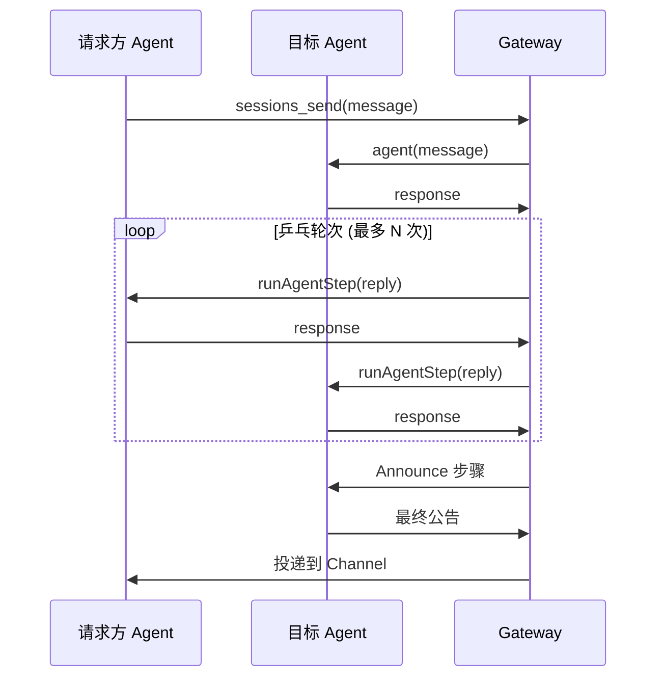
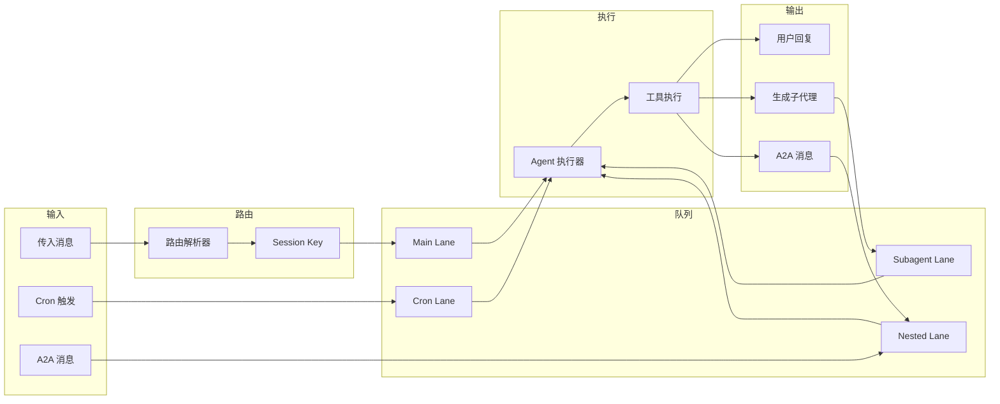

# OpenClaw Agent 编排架构分析

## 概述

OpenClaw 实现了一个复杂的多代理编排系统，使自主 AI 代理能够相互通信、生成子代理并协调复杂的工作流。本文档分析核心架构组件及其交互方式。

## 架构图



## 核心组件

### 1. Gateway Server (`server.impl.ts`)

**路径:** `/Users/swmt/work/deepwork/openclaw/src/gateway/server.impl.ts`

Gateway Server 是编排中枢，负责初始化和协调所有系统组件。

**核心职责:**
- 配置加载与验证
- 插件和 Channel 管理
- WebSocket/HTTP 服务器初始化
- Agent 事件处理
- 健康监控与维护

**关键初始化序列:**
```typescript
// Line 220-227: 核心初始化
const cfgAtStart = loadConfig();
initSubagentRegistry();
const defaultAgentId = resolveDefaultAgentId(cfgAtStart);
const defaultWorkspaceDir = resolveAgentWorkspaceDir(cfgAtStart, defaultAgentId);

// Line 373: 应用 Lane 并发设置
applyGatewayLaneConcurrency(cfgAtStart);
```

### 2. Agent Scope (`agent-scope.ts`)

**路径:** `/Users/swmt/work/deepwork/openclaw/src/agents/agent-scope.ts`

管理代理身份解析和配置。

**关键函数:**

| 函数 | 用途 |
|------|------|
| `listAgentIds()` | 返回所有已配置的 Agent ID |
| `resolveDefaultAgentId()` | 确定默认 Agent |
| `resolveAgentConfig()` | 获取完整的 Agent 配置 |
| `resolveAgentWorkspaceDir()` | 解析 Agent 工作区路径 |
| `resolveSessionAgentId()` | 从 Session Key 提取 Agent ID |

**Agent 配置结构:**
```typescript
type ResolvedAgentConfig = {
  name?: string;
  workspace?: string;
  agentDir?: string;
  model?: AgentEntry["model"];
  skills?: AgentEntry["skills"];
  memorySearch?: AgentEntry["memorySearch"];
  humanDelay?: AgentEntry["humanDelay"];
  heartbeat?: AgentEntry["heartbeat"];
  identity?: AgentEntry["identity"];
  groupChat?: AgentEntry["groupChat"];
  subagents?: AgentEntry["subagents"];
  sandbox?: AgentEntry["sandbox"];
  tools?: AgentEntry["tools"];
};
```

### 3. Subagent Registry (`subagent-registry.ts`)

**路径:** `/Users/swmt/work/deepwork/openclaw/src/agents/subagent-registry.ts`

管理生成的子代理的生命周期。

**子代理运行记录:**
```typescript
type SubagentRunRecord = {
  runId: string;
  childSessionKey: string;
  requesterSessionKey: string;
  requesterOrigin?: DeliveryContext;
  requesterDisplayKey: string;
  task: string;
  cleanup: "delete" | "keep";
  label?: string;
  createdAt: number;
  startedAt?: number;
  endedAt?: number;
  outcome?: SubagentRunOutcome;
  archiveAtMs?: number;
  cleanupCompletedAt?: number;
  cleanupHandled?: boolean;
};
```

**生命周期管理:**
1. **注册:** `registerSubagentRun()` - 创建新的子代理条目
2. **监控:** 事件监听器跟踪 `lifecycle.start`, `lifecycle.end`, `lifecycle.error`
3. **完成:** `waitForSubagentCompletion()` - 通过 Gateway RPC 等待
4. **清理:** `finalizeSubagentCleanup()` - 处理完成后的清理
5. **归档:** 清理器每 60 秒运行一次，归档旧的运行记录

### 4. 路由解析 (`resolve-route.ts`)

**路径:** `/Users/swmt/work/deepwork/openclaw/src/routing/resolve-route.ts`

根据绑定规则确定哪个 Agent 处理传入消息。

**匹配优先级 (从高到低):**
1. `binding.peer` - 直接对等匹配
2. `binding.peer.parent` - 线程父级继承
3. `binding.guild` - Guild/服务器匹配
4. `binding.team` - 团队匹配
5. `binding.account` - 账户匹配
6. `binding.channel` - Channel 匹配
7. `default` - 回退到默认 Agent

**Session Key 结构:**
```
agent:<agentId>:<channel>:<accountId>:<peerKind>:<peerId>
```

## Lane 并发控制

### Lane 类型 (`lanes.ts`)

**路径:** `/Users/swmt/work/deepwork/openclaw/src/process/lanes.ts`

```typescript
export const enum CommandLane {
  Main = "main",        // 主要用户交互
  Cron = "cron",        // 定时任务
  Subagent = "subagent", // 生成的子代理
  Nested = "nested",    // Agent 间通信
}
```

### 命令队列 (`command-queue.ts`)

**路径:** `/Users/swmt/work/deepwork/openclaw/src/process/command-queue.ts`

实现每个 Lane 的任务队列，支持可配置的并发。

**队列条目结构:**
```typescript
type QueueEntry = {
  task: () => Promise<unknown>;
  resolve: (value: unknown) => void;
  reject: (reason?: unknown) => void;
  enqueuedAt: number;
  warnAfterMs: number;
  onWait?: (waitMs: number, queuedAhead: number) => void;
};
```

**并发默认值:**

| Lane | 默认并发数 | 配置路径 |
|------|-----------|----------|
| Main | 4 | `agents.defaults.maxConcurrent` |
| Subagent | 8 | `agents.defaults.subagents.maxConcurrent` |
| Cron | 1 | `cron.maxConcurrentRuns` |
| Nested | 无限制 | N/A |

### Gateway Lane 应用 (`server-lanes.ts`)

**路径:** `/Users/swmt/work/deepwork/openclaw/src/gateway/server-lanes.ts`

```typescript
export function applyGatewayLaneConcurrency(cfg: ReturnType<typeof loadConfig>) {
  setCommandLaneConcurrency(CommandLane.Cron, cfg.cron?.maxConcurrentRuns ?? 1);
  setCommandLaneConcurrency(CommandLane.Main, resolveAgentMaxConcurrent(cfg));
  setCommandLaneConcurrency(CommandLane.Subagent, resolveSubagentMaxConcurrent(cfg));
}
```

## Agent 间通信 (A2A)

### Sessions Send 工具 (`sessions-send-tool.ts`)

**路径:** `/Users/swmt/work/deepwork/openclaw/src/agents/tools/sessions-send-tool.ts`

使 Agent 能够向其他 Agent 会话发送消息。

**关键特性:**
- 通过 Key 或 Label 解析会话
- 跨 Agent 策略执行
- 沙箱可见性限制
- 超时处理

**A2A 策略检查:**
```typescript
const a2aPolicy = createAgentToAgentPolicy(cfg);
if (isCrossAgent) {
  if (!a2aPolicy.enabled) {
    return jsonResult({ status: "forbidden", error: "Agent-to-agent messaging is disabled" });
  }
  if (!a2aPolicy.isAllowed(requesterAgentId, targetAgentId)) {
    return jsonResult({ status: "forbidden", error: "Agent-to-agent messaging denied" });
  }
}
```

### A2A 流程 (`sessions-send-tool.a2a.ts`)

**路径:** `/Users/swmt/work/deepwork/openclaw/src/agents/tools/sessions-send-tool.a2a.ts`

实现 Agent 之间的乒乓对话流程。

**流程序列图:**


**乒乓配置:**
- 可通过 `tools.agentToAgent.pingPongTurns` 配置最大轮次
- 每轮在 `AGENT_LANE_NESTED` 中运行以实现隔离
- 支持跳过信号 (`[SKIP]`, `[NO_REPLY]`)

### 子代理公告流程 (`subagent-announce.ts`)

**路径:** `/Users/swmt/work/deepwork/openclaw/src/agents/subagent-announce.ts`

处理子代理完成后向请求方的公告。

**公告模式:**
1. **Steer:** 注入到活动的嵌入运行中
2. **Queue:** 添加到公告队列以便稍后投递
3. **Direct:** 立即发送到请求方会话

**统计信息收集:**
```typescript
const statsLine = await buildSubagentStatsLine({
  sessionKey: params.childSessionKey,
  startedAt: params.startedAt,
  endedAt: params.endedAt,
});
// 输出: "Stats: runtime 2m30s - tokens 15.2k (in 12.1k / out 3.1k) - est $0.05 - sessionKey agent:default:..."
```

## Agent 工具概览

OpenClaw 提供 40+ 工具，按类别组织：

### 会话管理
| 工具 | 文件 | 用途 |
|------|------|------|
| `sessions_send` | `sessions-send-tool.ts` | 向另一个会话发送消息 |
| `sessions_spawn` | `sessions-spawn-tool.ts` | 创建新的子代理会话 |
| `sessions_list` | `sessions-list-tool.ts` | 列出可用会话 |
| `sessions_history` | `sessions-history-tool.ts` | 读取会话历史 |
| `session_status` | `session-status-tool.ts` | 获取当前会话状态 |

### 通信
| 工具 | 文件 | 用途 |
|------|------|------|
| `message` | `message-tool.ts` | 发送外部消息 |
| `agents_list` | `agents-list-tool.ts` | 列出可用 Agent |

### Web 与浏览器
| 工具 | 文件 | 用途 |
|------|------|------|
| `web_fetch` | `web-fetch.ts` | 获取网页内容 |
| `web_search` | `web-search.ts` | 搜索网络 |
| `browser` | `browser-tool.ts` | 浏览器自动化 |

### 平台特定
| 工具 | 文件 | 用途 |
|------|------|------|
| `discord_*` | `discord-actions*.ts` | Discord 操作 |
| `slack_*` | `slack-actions.ts` | Slack 操作 |
| `telegram_*` | `telegram-actions.ts` | Telegram 操作 |
| `whatsapp_*` | `whatsapp-actions.ts` | WhatsApp 操作 |

### 工具类
| 工具 | 文件 | 用途 |
|------|------|------|
| `memory` | `memory-tool.ts` | 长期记忆 |
| `cron` | `cron-tool.ts` | 定时任务 |
| `image` | `image-tool.ts` | 图像生成 |
| `tts` | `tts-tool.ts` | 文字转语音 |
| `canvas` | `canvas-tool.ts` | Canvas 操作 |
| `gateway` | `gateway-tool.ts` | Gateway 控制 |
| `nodes` | `nodes-tool.ts` | 节点管理 |

## 数据流图



## 配置参考

### Agent 配置
```yaml
agents:
  defaults:
    maxConcurrent: 4           # Main Lane 并发数
    workspace: "~/.openclaw/workspace"
    subagents:
      maxConcurrent: 8         # Subagent Lane 并发数
      archiveAfterMinutes: 60  # 自动清理延迟
    sandbox:
      sessionToolsVisibility: "spawned"  # "all" | "spawned"

  list:
    - id: "default"
      default: true
      name: "Main Agent"
      model: "claude-sonnet-4-20250514"
      skills: ["*"]
      subagents:
        enabled: true
        cleanup: "delete"      # "delete" | "keep"
```

### A2A 配置
```yaml
tools:
  agentToAgent:
    enabled: true
    pingPongTurns: 3
    allow:
      - from: "agent-a"
        to: "agent-b"
      - from: "*"
        to: "shared-agent"
```

### Cron 配置
```yaml
cron:
  maxConcurrentRuns: 1
  jobs:
    - id: "daily-summary"
      schedule: "0 9 * * *"
      agentId: "default"
      message: "Generate daily summary"
```

## 关键设计模式

### 1. Lane 隔离
每个 Lane 独立运行，有自己的并发限制，防止：
- 用户交互阻塞 Cron 任务
- 子代理饿死主 Agent
- A2A 通信阻塞用户响应

### 2. Session Key 规范化
所有会话引用都规范化为标准格式：
```
agent:<agentId>:<channel>:<accountId>:<peerKind>:<peerId>
```

### 3. 事件驱动的生命周期
子代理生命周期通过事件管理：
- `lifecycle.start` - Agent 运行开始
- `lifecycle.end` - Agent 运行完成
- `lifecycle.error` - Agent 运行失败

### 4. 优雅降级
- 持久化失败被静默忽略
- Announce 失败不会破坏调用方响应
- 清理是尽力而为

## 总结

OpenClaw 的 Agent 编排架构提供：

1. **可扩展的并发:** 基于 Lane 的队列，支持可配置的限制
2. **灵活的路由:** 基于优先级的绑定解析
3. **丰富的通信:** 完整的 A2A 消息传递，支持乒乓模式
4. **生命周期管理:** 完整的子代理跟踪和清理
5. **可扩展性:** 40+ 工具，支持插件

系统设计注重可靠性，具有优雅降级、事件驱动协调和全面的配置选项。

---

## 与 learn-claude-code 的对比

| learn-claude-code 阶段 | OpenClaw 对应 | 核心概念 |
|------------------------|---------------|----------|
| v0: Bash Agent | Stage 0: Agent Loop | 理解核心循环 |
| v1: Basic Agent | Stage 1: Tool 系统 | 理解 40+ 工具 |
| v2: Todo Agent | Stage 2: Session 状态 | 理解会话管理 |
| v3: Subagent | Stage 3: Subagent 编排 | 理解子代理机制 |
| v4: Skills | Stage 4: Skills/Plugins | 理解技能系统 |
| - | Stage 5: Channel 层 | 理解平台抽象 |
| - | Stage 6: Gateway | 理解完整编排 |

详细的渐进学习路径请参考 [progressive-learning-path.md](../progressive/progressive-learning-path.md)
